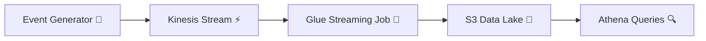

# 🎬 Netflix Streaming Data Pipeline (AWS)

> **End-to-end real-time data engineering project** simulating Netflix-style streaming events with **Kinesis → Glue Streaming → S3 → Athena**.  
> Built for production-style learning, portfolio showcasing, and recruiter-ready demonstrations.

---

## ✨ Features

- ⚡ Real-time ingestion with **Amazon Kinesis**
- 🔄 Streaming ETL using **AWS Glue (PySpark)**
- 📂 Partitioned **Parquet data lake on S3**
- 🔍 Interactive analytics with **Athena + Glue Data Catalog**
- 💰 Cost-aware, production-style design

---

## 🏗️ Architecture Overview



---

## 📦 Tech Stack

| Layer              | Service / Tool |
|--------------------|----------------|
| Ingestion          | Amazon Kinesis |
| Streaming ETL      | AWS Glue (PySpark) |
| Storage            | Amazon S3 (Parquet) |
| Catalog            | AWS Glue Data Catalog |
| Query              | Amazon Athena |

---

## 🗂️ Repository Structure

```text
aws-netflix-streaming-pipeline/
├── ingestion/
│   └── kinesis_producer/
│       ├── sample_events_generator.py
│       └── events_sample.json
├── streaming/
│   └── glue_streaming_jobs/
│       └── dev_netflix_events_stream.py
├── docs/
│   └── architecture/
│       └── netflix_streaming_pipeline_diagram.md
└── README.md
```

---

## 🔎 Example Athena Queries

```sql
-- Repair partitions
MSCK REPAIR TABLE netflix-streams-aws.raw_netflix_raw_events;

-- Preview recent events
SELECT * 
FROM netflix-streams-aws.raw_netflix_raw_events 
LIMIT 10;

-- Completion rate by title
SELECT
  title_id,
  COUNT_IF(event_type = 'complete') * 1.0 / COUNT(*) AS completion_rate
FROM netflix-streams-aws.raw_netflix_raw_events
GROUP BY title_id
ORDER BY completion_rate DESC
LIMIT 20;
```

---

## 📊 Data Model

- **Event Fields**: `user_id`, `title_id`, `event_type`, `country`, `device_type`, `event_timestamp`, `playback_position_sec`, `total_duration_sec`
- **Partitions**: `ingest_year`, `ingest_month`, `ingest_day`, `ingest_hour`

---

## 🚀 Future Enhancements

- 🧹 Curated S3 layers with transformations  
- 🏢 Redshift integration for heavy analytics  
- ✅ Data quality checks + retention policies  
- 📈 Dashboards with QuickSight  

---

## 🏅 Badges

`https://img.shields.io/badge/AWS-Glue%20%7C%20Kinesis%20%7C%20Athena-orange?logo=amazonaws`
`https://img.shields.io/badge/PySpark-Python-blue?logo=python`
`https://img.shields.io/badge/Data%20Engineering-Streaming%20ETL-green`

---

